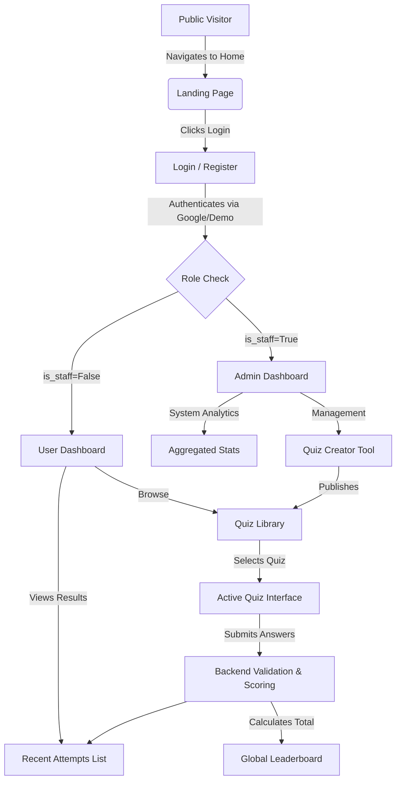

# Quiz Portal

A highly scalable Quiz Portal built with Django REST Framework (Backend) and Next.js + TypeScript (Frontend).

## Features
- Component-driven, feature-based Next.js frontend architecture.
- Scalable Django backend with dedicated apps for users, quizzes, and attempts.
- Interactive quiz attempts with timer and progress bar.
- Global leaderboard and results tracking.

## Project Structure
- `/backend`: Django project. Contains core configuration, apps (users, quizzes, attempts), and service layer.
- `/frontend`: Next.js App Router project containing UI components and feature-specific logic.
- `/screens`: Contains UI mockup screenshots of the platform.
- `SETUP.md`: Detailed documentation of the database schema and configurations.
- `DEPLOYMENT.md`: Step-by-step production hosting guidelines.

## Application Architecture & Flow Chart



## Setup Instructions

### Backend (Django)
1. Navigate to the backend directory:
   ```bash
   cd backend
   ```
2. Create and activate a virtual environment:
   ```bash
   python -m venv venv
   # On Windows:
   venv\Scripts\activate
   # On macOS/Linux:
   source venv/bin/activate
   ```
3. Install dependencies:
   ```bash
   pip install -r requirements.txt
   ```
4. Run database migrations:
   ```bash
   python manage.py migrate
   ```
   *(Note: The project defaults to SQLite for ease of evaluation. To use PostgreSQL, update `DATABASES` in `backend/core/settings.py` with your PSQL credentials.)*
5. Start the backend development server:
   ```bash
   python manage.py runserver
   ```
   The API will be available at `http://localhost:8000/api/`.

### Frontend (Next.js)
1. Ensure you have Node.js installed.
2. Navigate to the frontend directory:
   ```bash
   cd frontend
   ```
3. Install dependencies:
   ```bash
   npm install
   ```
4. Run the development server:
   ```bash
   npm run dev
   ```
5. Open `http://localhost:5173` in your browser.

## Google OAuth
This project is configured for real Google OAuth via `@react-oauth/google`. To enable it:
1. Go to Google Cloud Console and obtain an OAuth 2.0 Client ID.
2. In the `backend` directory, set `GOOGLE_CLIENT_ID` in `core/settings.py` (or via environment variables).
3. In the `frontend` directory, create a `.env.local` file with the following variables:
   ```env
   NEXT_PUBLIC_GOOGLE_CLIENT_ID=your-google-client-id.apps.googleusercontent.com
   NEXT_PUBLIC_API_URL=http://localhost:8000/api
   ```
4. Ensure `http://localhost:5173` is added as an **Authorized JavaScript origin** in your Google Cloud credentials.
